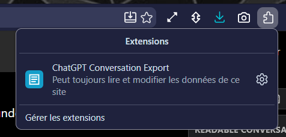
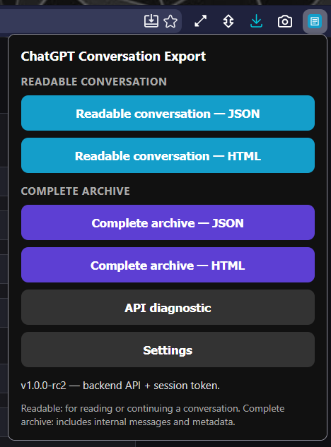
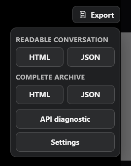
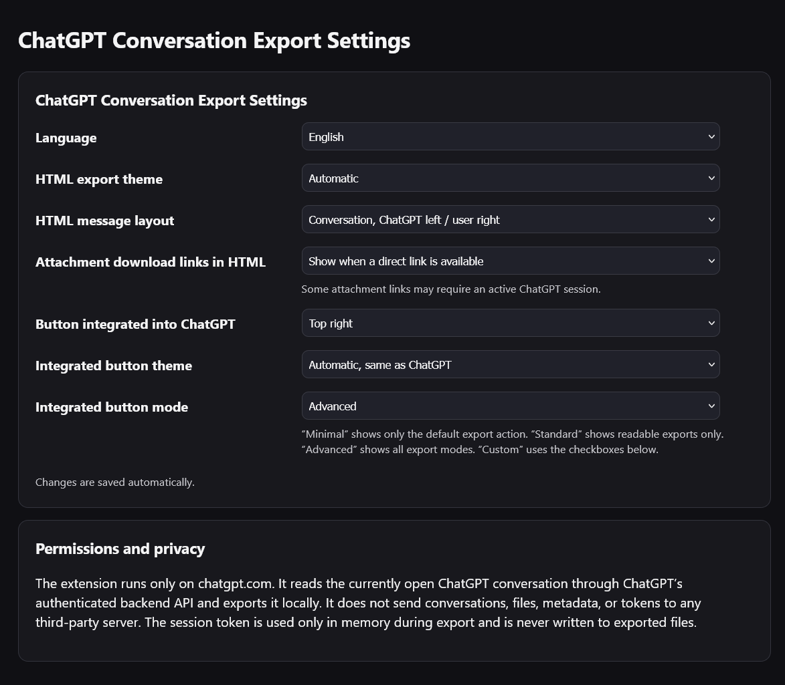
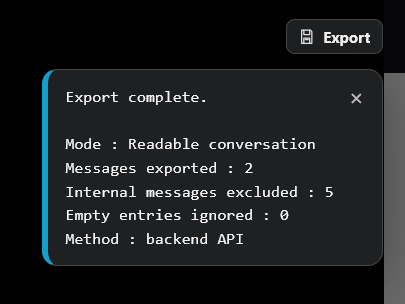
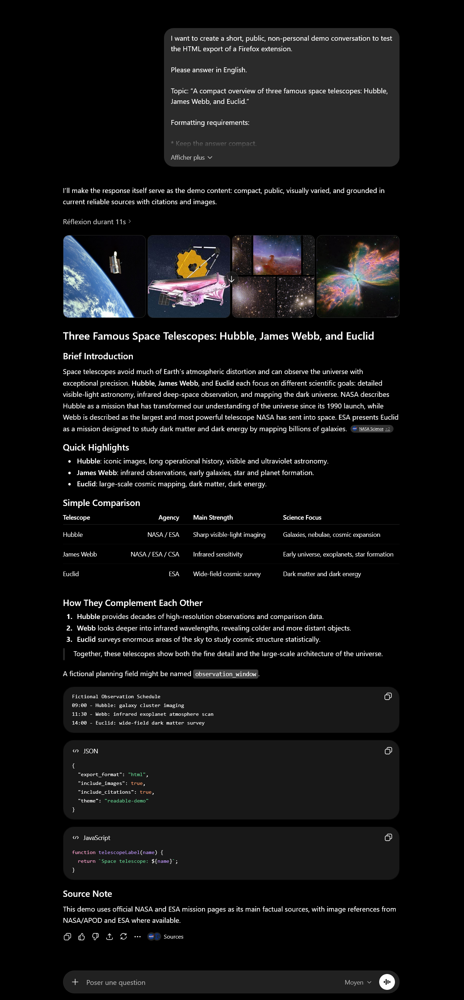
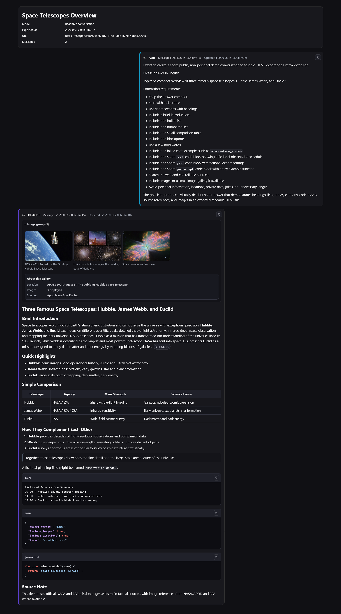
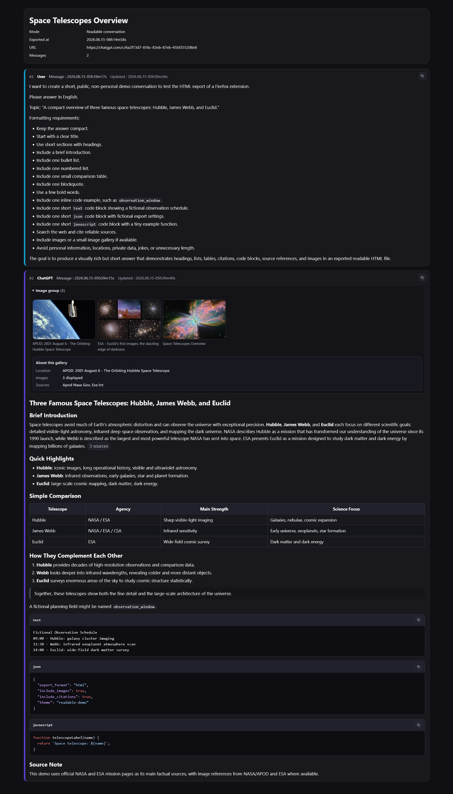

# ChatGPT Conversation Export

ChatGPT Conversation Export est une extension Firefox non officielle permettant d’exporter la conversation ChatGPT actuellement ouverte.

L’extension produit des fichiers locaux, en JSON ou en HTML, sans envoyer les conversations vers un serveur tiers.

## Fonctionnalités

- Export de la conversation lisible en JSON.
- Export de la conversation lisible en HTML.
- Export d’une archive complète en JSON.
- Export d’une archive complète en HTML.
- Rendu HTML proche de la conversation ChatGPT : titres, listes, tableaux, blocs de code, citations et sources.
- Bouton intégré dans l’interface ChatGPT.
- Paramètres de langue, thème, position du bouton et actions visibles.

## Pourquoi cette extension existe

ChatGPT Conversation Export a été créé pour les utilisateurs qui travaillent avec des conversations longues, complexes, et qui ont besoin d’un moyen fiable de les conserver ou de les reprendre.

Les longues conversations ChatGPT peuvent finir par devenir difficiles à utiliser : la page peut ralentir, les réponses peuvent prendre beaucoup plus de temps, le modèle peut se répéter, perdre le fil des décisions déjà prises, oublier une partie du travail effectué ou commettre davantage d’erreurs lorsque la conversation devient trop volumineuse et trop chargée.

L’extension permet d’exporter la conversation en cours vers des fichiers locaux lisibles, afin de pouvoir :

* conserver une sauvegarde hors ligne des conversations importantes ;
* préserver le travail déjà réalisé ;
* relire de longues conversations en dehors de l’interface ChatGPT ;
* extraire le contexte utile avant de démarrer une nouvelle conversation ;
* reprendre un projet à partir d’un prompt plus propre et plus court ;
* réduire le risque de perdre des détails importants lorsqu’une conversation devient trop longue pour être poursuivie confortablement.

L’objectif n’est donc pas seulement d’archiver les conversations, mais aussi de rendre les travaux longs plus faciles à reprendre, transférer et documenter.

## Captures d’écran

### Panneau de l’extension Firefox

### Popup de l’extension

### Bouton intégré dans ChatGPT

### Page des paramètres

### Confirmation d’export intégré

### Conversation de démonstration dans ChatGPT

### Rendu conversationnel de l’export HTML lisible

### Export HTML lisible en pleine largeur

## Formats d’export

### Conversation lisible

Ce mode privilégie la consultation humaine. Il nettoie les éléments internes inutiles et présente les messages dans une forme plus proche de la conversation originale.

Le rendu HTML peut afficher :

- les blocs de code avec leur langage ;
- les tableaux Markdown ;
- les listes imbriquées ;
- les images et galeries lorsque les métadonnées sont disponibles ;
- les fichiers joints référencés ;
- les sources web sous forme de boutons et panneaux de détails.

### Archive complète

Ce mode conserve davantage de métadonnées techniques afin de faciliter la vérification, le diagnostic ou une future récupération plus complète des contenus liés.

## Confidentialité

L’extension fonctionne localement dans le navigateur.

Elle utilise la session ChatGPT déjà active dans l’onglet ouvert afin de récupérer la conversation courante via les API de ChatGPT. Le token de session est utilisé en mémoire uniquement pendant l’export. Il n’est pas stocké et n’est pas écrit dans les fichiers générés.

L’extension n’envoie pas les conversations, fichiers, métadonnées, paramètres ou tokens vers un serveur tiers.

Voir aussi : `PRIVACY.fr.md`.

## Permissions

L’extension demande uniquement les permissions nécessaires à son fonctionnement :

- `storage` : enregistrer les paramètres locaux de l’extension ;
- `https://chatgpt.com/*` : accéder à la page ChatGPT ouverte et exporter la conversation active.

## Limites connues

ChatGPT peut modifier son interface ou ses API internes. Dans ce cas, l’export peut nécessiter une mise à jour de l’extension.

Certaines images, sources ou pièces jointes peuvent être présentes uniquement sous forme de référence interne ou d’URL distante. Lorsque l’aperçu direct n’est pas disponible, l’extension conserve les informations utiles au lieu de fabriquer un faux contenu.

L’export PDF direct n’est pas encore intégré. Le fichier HTML exporté peut toutefois être imprimé en PDF depuis le navigateur.

## Indépendance

ChatGPT Conversation Export est une extension non officielle. Elle n’est pas développée, approuvée ni affiliée à OpenAI.

## Licence

Ce projet est placé sous Mozilla Public License 2.0.

Copyright (c) 2026 John2022.
